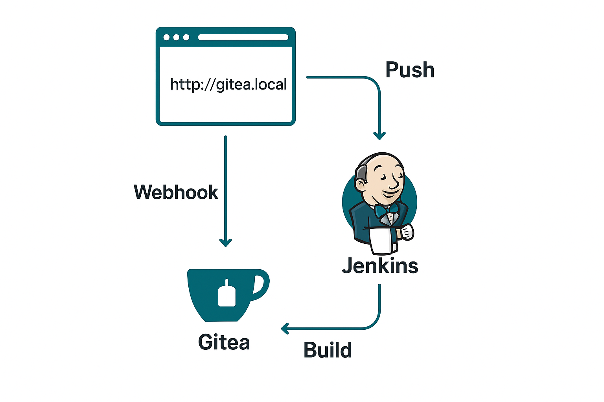

# CI/CD Pipeline with Jenkins and Gitea
The following diagram illustrates the CI/CD workflow for this project, integrating Gitea as the Git repository and Jenkins as the automation server.

Workflow:
1. Code Commit – Developers push code changes to the Gitea repository.
2. Webhook Trigger – Gitea sends a webhook notification to Jenkins upon every push.
3. Pipeline Execution – Jenkins fetches the latest code and runs the pipeline defined in the Jenkinsfile.
4. Build & Test – The pipeline builds the project, runs automated tests, and prepares artifacts.
5. Deploy – If the build and tests pass, Jenkins deploys the application to the target environment.

This setup enables a fully automated continuous integration and deployment process, reducing manual work and ensuring faster, more reliable releases.



## Prerequisites

- Ubuntu Server with Docker installed
- Basic understanding of command line
- At least 4GB RAM and 20GB storage
- Domain names or local IP access


## Part 1: DevOps Stack Setup

### 1.1 Create DevOps Directory Structure

cd ~/devops-homelab/
mkdir -p gitea/{data,config,postgres-data}
mkdir -p jenkins/data
sudo chown -R 1000:1000 gitea/ jenkins/

# Create shared network for docker
docker network create yourNetworkBridge

# Start services
docker-compose up -d


### 1.2 Configure Gitea

1. Open browser: `http://your-server-ip:3000`
2. Initial setup will appear automatically
3. Database settings (should be pre-filled):
   - Database Type: PostgreSQL
   - Host: gitea-db:5432
   - Username: giteaUser
   - Password: (from your .env file)
   - Database Name: giteaDB
4. General settings:
   - Site Title: Your Homelab Git
   - Repository Root Path: /data/git/repositories
   - Git LFS Root Path: /data/git/lfs
   - Run As Username: git
   - SSH Server Domain: your-server-ip
   - SSH Port: 2222
   - HTTP Port: 3000
   - Application URL: http://your-server-ip:3000/
5. Admin account setup: Create your admin user
6. Click "Install Gitea"


### 1.3 Configure Jenkins

1. Open browser: `http://your-server-ip:8080`
2. Get initial admin password:
   ```bash
   docker exec jenkins cat /var/jenkins_home/secrets/initialAdminPassword
   ```
3. Enter the password
4. Install suggested plugins
5. Create admin user
6. Set Jenkins URL: `http://your-server-ip:8080/`


## Part 2: Git and Jenkins Setup

### 2.1 Prerequisites

- Both are in the same Docker network if using Docker
- You have a Git repository in Gitea
- You can access both Jenkins and Gitea from your browser


### 2.2 Create a Test Repository in Gitea

1. Log in to your Gitea.
2. Create a new repository:
   - Name: helloWorld (example)
   - Visibility: your choice (Private or Public).
3. Add a Jenkinsfile to the repository root:
   ```bash
   pipeline {
      agent any
      stages {
         stage('Build') {
            steps {
               echo 'Building the project...'
            }
         }
      }
   }
   ```

### 2.3 Connect Jenkins to Gitea Repository
Using SSH (More secure, advanced)

1. Generate an SSH key inside the Jenkins container:
   ```bash
   docker exec -it <jenkins_container> bash
   ssh-keygen -t rsa -b 4096 -C "YourJenkins@YourGitea"
   ```

   Press Enter for all prompts.

2. Copy the public key:
   ```bash
   cat ~/.ssh/id_rsa.pub
   ```

3. In Gitea, go to Settings → SSH / GPG Keys → Add SSH Key, paste it.
4. Add private key in Jenkins credentials:
   - Kind: SSH Username with private key
   - Username: YourDesiredUsername
   - Paste the private key from ~/.ssh/id_rsa


### 2.4 Create the Jenkins Pipeline Job

1. In Jenkins, click New Item → Pipeline → Name it "anythingYouWant".
2. In Pipeline script from SCM:
   - SCM: Git
   - Repository URL (HTTP example): http://YourGitContainerName:3000/YourUserName/YourGitReposName.git
   - Credentials: gitea-http (or your SSH one)
   - Branch: main (or your default branch)
3. Save


### 2.5 First Build

1. Click Build Now in Jenkins.
2. If configured correctly, Jenkins should:
   - Clone the repo from Gitea.
   - Find and run your Jenkinsfile.
   - Show SUCCESS in the console output.


### 2.6 First Build

1. In Gitea, open your repository → Settings → Webhooks → Add Webhook → Gitea.
2. Target URL: http://YourJenkinsContainerName:8080/gitea-webhook/post
3. Trigger on: Push events (and optionally PR events).
4. Save.
5. In Jenkins:
   - Install Gitea Plugin.
   - In your job, enable Build when a change is pushed to Gitea.

Now every push to Gitea will trigger the Jenkins build automatically.


### 2.7 Notes & Troubleshooting

1. If Jenkins can’t reach Gitea via hostname, add the mapping in Docker:
   ```bash
   docker network connect yourNetworkBridge jenkins
   docker network connect yourNetworkBridge gitea
   ```

2. For SSH, you may need to add the Gitea host to known_hosts:
   ```bash
   ssh-keyscan -t rsa gitea >> ~/.ssh/known_hosts
   ```

3. Use HTTP first, then switch to SSH once you’re comfortable.